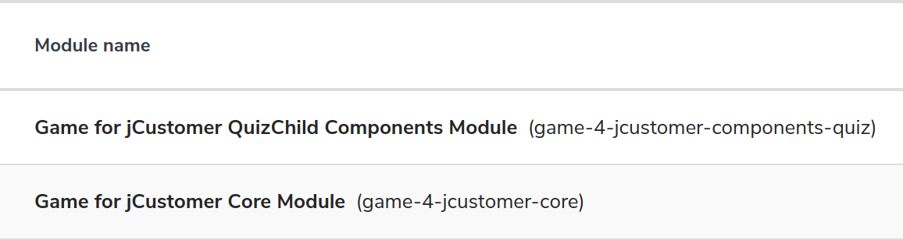
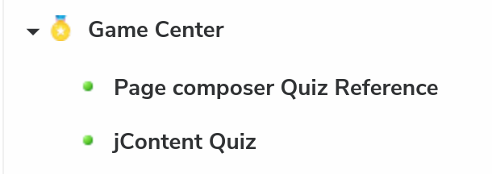

# Gamification For jCustomer

This project is composed by 5 components:
1. A core component which define common mixin
1. A Quiz component which is used to enable the quiz creation in jContent
1. A React application which render the quiz content created in jContent
1. A Package builder
1. A jCustomer plugin embedding a custom action (example of custom action but not used)

## Overview
This project is a Jahia Accelerator, so it presents a lots of implementation example on
*how to create an headless application* configured from Jahia and consuming Jahia content.
The React quiz web application get editorial content and configuration content from Jahia.
The module allow also to interact with jExperience to enhanced user profile and improve content
personalization.

Also, the user can :
* override some part of the application `theme`,
* enable/disable transition between slides
* override the static labels used in the application (like "start" button)
* enable a marketo form before to start the quiz
* synchronize user response with the CDP jExperience
* use a personalized content to present user results

<!-- The jahia Assessment Tool module is an good usage example of this module --> 
## QuickStart
### Prerequisite
This module needs
* widen-picker >= 2.1.0
* codemirror-editor >= 1.1.2

### Install
Import the package module in your Jahia server. This deploys 2 modules :
* game-4-jcustomer-components-quiz
* game-4-jcustomer-core

  
To be able to create Quiz enable game-4-jcustomer-components-quiz for your project.

Now your are able to create a Quiz in jContent or create a Quiz Reference in Page composer.

When you have a quiz create you can create subcontent like *Question and Answer* (Qna) and *Warmup*

[100]: doc/images/100_modules.png

[comment]: <> ([200]: doc/images/200_contentToCreate.png)

[comment]: <> ([202]: doc/images/202_subContent.png)

